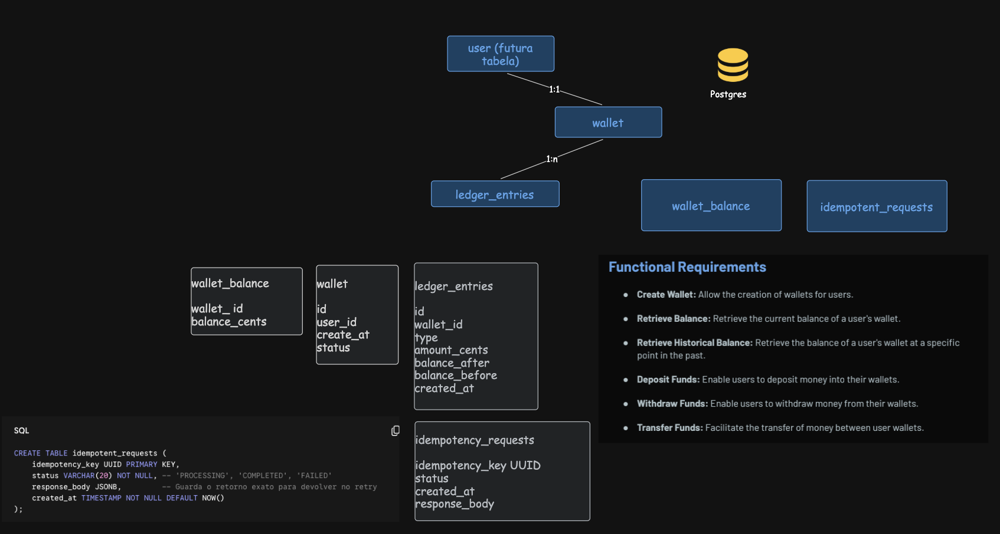

# wallet

Trade-offs:
I decided to not create the table user to simplify our solution.
Postgres was chosen because of its ACID guarantees.
The "user" table was not created in order to simplify the solution and keep it as a functional MVP.
The main strategy is use a pessimistic lock to avoid collision with begin tran on Posgtres. We must always lock first the smaller wallet_id wallet first to avoid deadlock.
One of the biggest challenges of the project is maintaining transaction integrity while also supporting high scalability.
Postgres itself is used to control idempotency, avoiding the dual-write problem. The client application, app should generate the idempotency key UUID, which will be stored in the idempotency table.
The ledger_entries table is immutable and works as an audit log.
The wallet_balance table is a snapshot table to make real-time balance reads easier for the app.



This repository contains a Spring Boot API named `wallet` and a Docker Compose setup to run the API together with a PostgreSQL database.

Checklist
 - [x] Build the project jar (locally or via Dockerfile multi-stage build)
 - [x] Start Postgres and the app using `docker compose`
 - [x] Override DB credentials via environment variables or a `.env` file

Prerequisites
 - Docker and Docker Compose (or Docker with Compose plugin)
 - (Optional) Java 17 and Maven if you want to build the jar locally

Quick start (recommended - uses Docker Compose to build and run)

1. From the project root (where `docker-compose.yml` and `Dockerfile` are located) run:

```bash
docker compose up --build -d
# or, if you have older Docker:
# docker-compose up --build -d
```

This will:
 - Start a Postgres database (service `db`) with default credentials
 - Build the `wallet` image using the included `Dockerfile` and start the Spring Boot app

2. View logs:

```bash
docker compose logs -f wallet
# docker-compose logs -f wallet
```

3. Access the app at:

- http://localhost:8080 (if your app exposes endpoints on the root)

Stop and remove containers:

```bash
docker compose down
# To remove the DB volume (persistent data), use:
docker compose down -v
```

Alternative: Build jar locally and run with Docker Compose (faster on repeated runs)

1. Build the jar locally:

```bash
mvn -DskipTests package
```

2. Then start the services (the Dockerfile will copy the jar produced in `target/`):

```bash
docker compose up --build -d
```

Environment variables

The application reads DB settings from environment variables (defaults are set in `docker-compose.yml`):

- DB_HOST (defaults to `db` in compose)
- DB_PORT (defaults to `5432`)
- DB_NAME (defaults to `walletdb`)
- DB_USER (defaults to `walletuser`)
- DB_PASSWORD (defaults to `walletpass`)

You can override these by creating a `.env` file in the project root or by providing env vars to Docker Compose. Example `.env` contents:

```ini
DB_HOST=db
DB_PORT=5432
DB_NAME=walletdb
DB_USER=walletuser
DB_PASSWORD=walletpass
```

Notes and recommendations
 - `spring.jpa.hibernate.ddl-auto=update` is set in `application.properties` to make local development simpler. This is not recommended for production. Use Flyway or Liquibase for DB migrations in production.
 - Consider adding a `.dockerignore` and `.env.example` to the repo to avoid committing secrets and to reduce build context size.
 - If you want a healthcheck or a readiness probe, we can add it to `docker-compose.yml`.

Troubleshooting
 - If the app fails to connect to the DB, check `docker compose logs db` and `docker compose logs wallet`.
 - If ports are already in use, either stop the processes on those ports or change the published port mappings in `docker-compose.yml`.

If you'd like, I can add a `.dockerignore`, a `.env.example`, and a small healthcheck for the `wallet` service.

